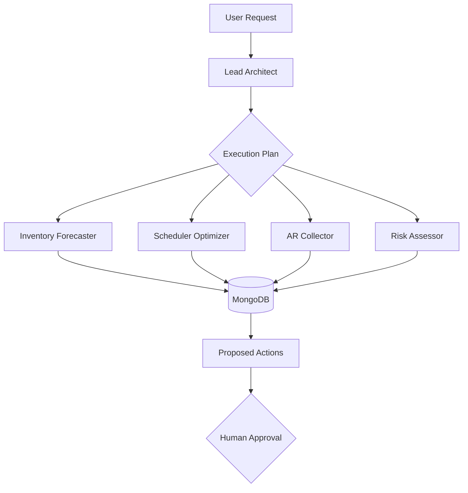

# HVAC OpsForge

**Autonomous AI Operations Co-Pilot for HVAC & Trade Services**

[](https://python.org/)
[](https://fastapi.tiangolo.com/)
[](https://streamlit.io/)
[](https://www.mongodb.com/)
[](https://opensource.org/licenses/MIT)

> Transform reactive HVAC operations into proactive, data-driven workflows with an intelligent multi-agent system.

## Overview

**HVAC OpsForge** is a production-ready multi-agent framework that automates core operations for HVAC and trade service businesses. It uses a Lead Architect agent to coordinate specialist agents for inventory forecasting, smart scheduling, accounts receivable follow-up, and operational risk detection — while always keeping humans in control.

Originally built for the **Google Cloud Rapid Agent Hackathon 2026**, it now features a polished interactive Streamlit dashboard with full synthetic demo mode.

## ✨ Key Features
- **🤖 Multi-Agent Orchestration** — Lead Architect coordinates specialists
- **📦 Intelligent Inventory Management** — Predictive forecasting & reordering
- **📅 Smart Scheduling** — Skill/location/urgency optimized routes
- **💰 Automated AR Workflows** — Overdue invoice detection & reminders
- **⚠️ Risk Detection** — Proactive alerts for stock, cashflow, and scheduling issues
- **👤 Human-in-the-Loop** — All actions require approval
- **📊 Premium Interactive Dashboard** — Branded Streamlit UI with synthetic demo data

## Phase 1 Demo (Try It Now)

1. `streamlit run streamlit_app.py`
2. Click **Load Demo Company**
3. Click **Run Multi-Agent Dispatch**
4. Explore KPIs, agent trace, dispatch board, inventory, AR queue, and export options

**Screenshots / GIFs** (add these to the repo):
- Branded hero with KPI ribbon
- Full demo flow (sidebar → results)
- AR tab with approve/reject controls
- Export buttons in action

## Quick Start

```bash
git clone https://github.com/jayjz/hvac-ops-agent.git
cd hvac-ops-agent

python -m venv venv
.\venv\Scripts\Activate.ps1   # Windows
# source venv/bin/activate    # macOS/Linux

pip install -r requirements.txt
streamlit run streamlit_app.py
```

**Docker** (full stack with MongoDB):
```bash
docker compose up -d
```

## Architecture



## Tech Stack
- **Backend**: FastAPI + Python 3.11+
- **Agents**: Modular orchestration with Lead Architect + specialists
- **Frontend**: Streamlit (primary dashboard)
- **Data**: MongoDB Atlas + Motor
- **DevOps**: Docker Compose, Nginx, pytest

## Project Status
**Phase 1 Complete** — Branded premium demo UI with synthetic data, exports, and basic human-in-the-loop controls.  
Live MongoDB flows, advanced charts, and additional integrations are next.

**Version**: 0.4.0-demo  
**Last Updated**: July 2026

## Contributing
See [CODEX.md](CODEX.md) for guidelines. Open issues for major changes.

## License
MIT — see [LICENSE](LICENSE) file.

---
