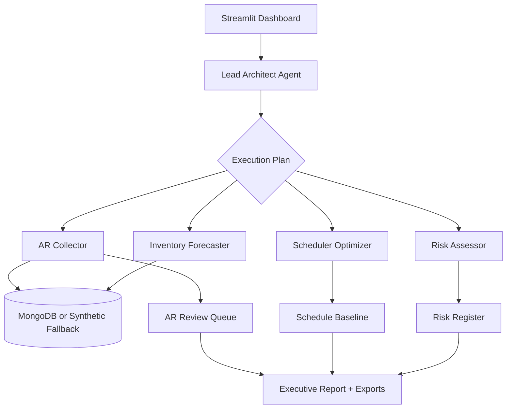

# HVAC OpsForge

**Multi-agent operations co-pilot for HVAC and trade service teams.**

<<<<<<< HEAD
[](https://python.org/)
[](https://streamlit.io/)
[](https://fastapi.tiangolo.com/)
[](https://www.mongodb.com/)
[](https://opensource.org/licenses/MIT)

HVAC OpsForge turns fragmented service operations data into an executive-ready dispatch baseline. A lead architect agent coordinates specialists for inventory forecasting, scheduling, accounts receivable follow-up, and operational risk analysis, with clear human review before action.

Built for the **Google Cloud Rapid Agent Hackathon 2026**, this Phase 1 release focuses on a polished Streamlit demo, robust synthetic fallback, optional Live MongoDB execution, agent trace visibility, AR approval controls, and exportable reports.

## Try the Demo
=======
> Transform reactive HVAC operations into proactive, data-driven workflows with an intelligent multi-agent system.

[](https://python.org/)
[](https://fastapi.tiangolo.com/)
[](https://streamlit.io/)
[](https://www.mongodb.com/)
[](https://opensource.org/licenses/MIT)

## Overview

HVAC OpsForge is a production-ready multi-agent framework designed to automate core operations for HVAC and trade service businesses. Built on a modular agent architecture, it orchestrates specialized AI agents to handle inventory management, job scheduling, accounts receivable, and operational risk assessment.

Originally developed for the **Google Cloud Rapid Agent Hackathon 2026**, the system demonstrates how autonomous agents can reduce operational overhead while keeping humans in control of critical decisions.

## ✨ Key Features
- **🤖 Multi-Agent Orchestration** — Lead Architect coordinates specialist agents
- **📦 Intelligent Inventory Management** — Predictive forecasting
- **📅 Smart Scheduling** — Optimized technician assignments
- **💰 Automated AR Workflows** — Overdue invoice handling
- **⚠️ Risk Detection** — Proactive alerts
- **👤 Human-in-the-Loop** — Approval required for actions
- **📊 Interactive Dashboard** — Polished Streamlit UI (Phase 1 Demo Ready)

## Phase 1 Demo (Try It Now)
The Streamlit dashboard runs immediately with **synthetic HVAC data** — no MongoDB required for demo.

1. `streamlit run streamlit_app.py`
2. Click **Load Demo Company**
3. Click **Run Multi-Agent Dispatch**
4. Explore KPI metrics, agent trace, dispatch board, inventory, and AR tabs

**Recommended screenshots/GIFs for README:**
- Branded hero + KPI ribbon
- Sidebar demo flow
- Agent Command Center after simulation
>>>>>>> dev/ai-integration

## Quick Start
```bash
git clone https://github.com/jayjz/hvac-ops-agent.git
cd hvac-ops-agent
<<<<<<< HEAD

python -m venv venv
.\venv\Scripts\Activate.ps1
pip install -r requirements.txt

streamlit run streamlit_app.py
```

Then open the local Streamlit URL and run:

1. Leave **Live Mongo** disabled for the instant synthetic demo.
2. Click **Use Synthetic HVAC Data** if it is not already selected.
3. Review or edit the analysis goals in the sidebar.
4. Click **Run Multi-Agent Dispatch**.
5. Review the agent trace, requirements, risks, schedule, AR queue, and exports.

## Technician Dispatch Mobile View

After a run completes, open the **Technician Dispatch** tab for a field-ready mobile workflow:

1. Review the prioritized job list with stop order, status, ETA, site, next action, and proof requirements.
2. Check off staged parts in the parts checklist before the technician rolls.
3. Review field risks and mitigations beside the optimized route.
4. Click **Export Offline JSON** to download `hvac_opsforge_technician_dispatch.json` for use when connectivity is unreliable.

Example field workflow: a dispatcher runs the synthetic demo in the office, opens **Technician Dispatch** on a phone or tablet, confirms the filter set, belt kit, controls sensor, and fasteners are staged, then exports the offline JSON before sending the tech to the first route stop.

## QuickBooks-Compatible Exports

Dispatch Baseline data can be exported as QuickBooks-friendly invoice, schedule, and parts files. The export maps common fields such as customer, invoice number, due date, product/service, quantity, amount, SKU, cost, reorder point, and preferred vendor.

```python
from core.dispatch_baseline import build_dispatch_baseline_sync, save_quickbooks_exports

baseline = build_dispatch_baseline_sync(
    goals=["Prioritize backlog, stage parts, and recover overdue AR"],
    use_mongo=False,
)

paths = save_quickbooks_exports(baseline, "exports/quickbooks")
print(paths["quickbooks_invoices.csv"])
print(paths["quickbooks_dispatch_baseline.xlsx"])
```

Generated files:
- `quickbooks_invoices.csv`
- `quickbooks_schedule.csv`
- `quickbooks_parts.csv`
- `quickbooks_dispatch_baseline.xlsx`

## Live Mongo Mode

Live Mongo is optional. The dashboard always shows connection status in the sidebar and falls back to synthetic data if MongoDB is disabled or unavailable.

```powershell
$env:MONGO_URI="mongodb://localhost:27017/"
streamlit run streamlit_app.py
```

Expected database: `hvac_ops`

Expected collections:
- `jobs`
- `inventory`
- `invoices`

Demo flow with Live Mongo:

1. Start MongoDB locally, use Docker Compose, or point `MONGO_URI` at MongoDB Atlas.
2. Enable **Live Mongo** in the sidebar.
3. Confirm the sidebar reports a healthy MongoDB connection.
4. Click **Run Multi-Agent Dispatch**.
5. If the live run fails, the UI shows the error, preserves partial output when available, and falls back to the synthetic baseline.

## Screenshots

Place screenshots in `docs/assets/` so GitHub renders them reliably:

```text
docs/assets/dashboard-overview.png
docs/assets/live-mongo-sidebar.png
docs/assets/agent-trace-results.png
docs/assets/ar-review-queue.png
docs/assets/export-panel.png
```

Recommended captures:
- Dashboard first screen with sidebar and run workspace.
- Live Mongo enabled with healthy connection status.
- Results page showing source indicator and agent trace.
- AR tab with approve/reject decisions and review progress.
- Export panel with ZIP, Markdown, Dispatch CSV, and AR CSV.

Once added, embed them here:

```markdown


```

## What It Does

- Coordinates a multi-agent workflow from business goals to operating plan.
- Builds a requirements register from uploaded artifacts or synthetic HVAC scope.
- Flags delivery, procurement, controls, budget, scheduling, and AR risks.
- Produces an optimized schedule baseline and critical path summary.
- Identifies overdue invoices and supports approve/reject review.
- Exports report packages, Markdown summaries, CSV tables, and risk charts.
- Uses Live MongoDB when available and a deterministic synthetic fallback when not.

## Architecture



## Tech Stack

- **Frontend**: Streamlit dashboard
- **Backend**: FastAPI-ready Python services
- **Agents**: Lead architect plus inventory, risk, scheduling, and AR specialists
- **Data**: MongoDB live mode with synthetic fallback
- **Analysis**: Pandas, Matplotlib, PuLP
- **Deployment**: Docker Compose support

## Phase 1 Status

**Complete:** polished Streamlit demo, Live Mongo healthcheck, synthetic fallback, agent trace, AR approval controls, export grouping, and dashboard reset/new-run controls.

**Next:** richer seeded demo data, hosted demo environment, deeper Mongo writeback workflows, and expanded technician dispatch optimization.

## License

MIT. See [LICENSE](LICENSE).
=======
python -m venv venv
source venv/bin/activate    # Windows: venv\Scripts\activate
pip install -r requirements.txt
streamlit run streamlit_app.py
```

### Docker
```bash
docker compose up -d
```

(Full architecture, tech stack, usage examples, testing, and contributing sections from the original `main` branch remain below...)

## License
MIT License
```
